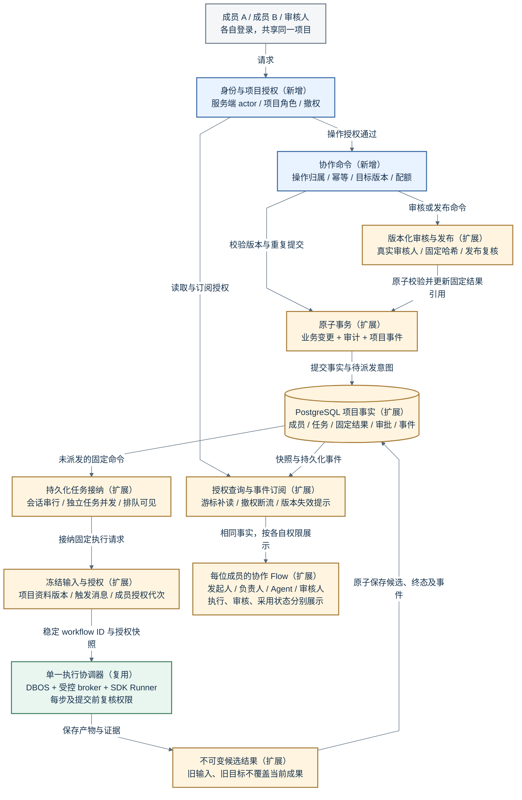

# 多人共享项目：目标架构

设计目标，尚未实现。蓝色为新增能力，橙色为现有模块扩展，绿色为复用执行器。首版仍使用单宿主、单一执行协调器。

```mermaid
%%{init: {"theme":"base","look":"classic","layout":"dagre","themeVariables":{"fontFamily":"Arial, PingFang SC, sans-serif","fontSize":"17px","primaryTextColor":"#17324d","lineColor":"#52677a","edgeLabelBackground":"#ffffff"},"flowchart":{"htmlLabels":true,"wrappingWidth":420,"curve":"linear","nodeSpacing":28,"rankSpacing":45}}}%%
flowchart TB
    people["成员 A / 成员 B / 审核人<br/>各自登录，共享同一项目"]
    identity["身份与项目授权（新增）<br/>服务端 actor / 项目角色 / 撤权"]
    commands["协作命令（新增）<br/>操作归属 / 幂等 / 目标版本 / 配额"]
    tx["原子事务（扩展）<br/>业务变更 + 审计 + 项目事件"]
    state[("PostgreSQL 项目事实（扩展）<br/>成员 / 任务 / 固定结果 / 审批 / 事件")]
    admission["持久化任务接纳（扩展）<br/>会话串行 / 独立任务并发 / 排队可见"]
    runner["单一执行协调器（复用）<br/>DBOS + 受控 broker + SDK Runner<br/>每步及提交前复核权限"]
    scope["冻结输入与授权（扩展）<br/>项目资料版本 / 触发消息 / 成员授权代次"]
    candidate["不可变候选结果（扩展）<br/>旧输入、旧目标不覆盖当前成果"]
    approval["版本化审核与发布（扩展）<br/>真实审核人 / 固定哈希 / 发布复核"]
    projection["授权查询与事件订阅（扩展）<br/>游标补读 / 撤权断流 / 版本失效提示"]
    flow["每位成员的协作 Flow（扩展）<br/>发起人 / 负责人 / Agent / 审核人<br/>执行、审核、采用状态分别展示"]
    people -->|请求| identity
    identity -->|操作授权通过| commands
    identity -->|读取与订阅授权| projection
    commands -->|校验版本与重复提交| tx
    tx -->|提交事实与待派发意图| state
    state -->|未派发的固定命令| admission
    admission -->|接纳固定执行请求| scope
    scope -->|稳定 workflow ID 与授权快照| runner
    runner -->|保存产物与证据| candidate
    candidate -->|原子保存候选、终态及事件| state
    commands -->|审核或发布命令| approval
    approval -->|原子校验并更新固定结果引用| tx
    state -->|快照与持久化事件| projection
    projection -->|相同事实，按各自权限展示| flow
    classDef new fill:#e9f2ff,stroke:#3a6ba5,stroke-width:2px;
    classDef extend fill:#fff4df,stroke:#a67c39,stroke-width:2px;
    classDef reuse fill:#e9f5ef,stroke:#438265,stroke-width:2px;
    classDef human fill:#f4f6f8,stroke:#6f7c89,stroke-width:2px;
    class people human;
    class identity,commands new;
    class tx,state,admission,scope,candidate,approval,projection,flow extend;
    class runner reuse;
```
